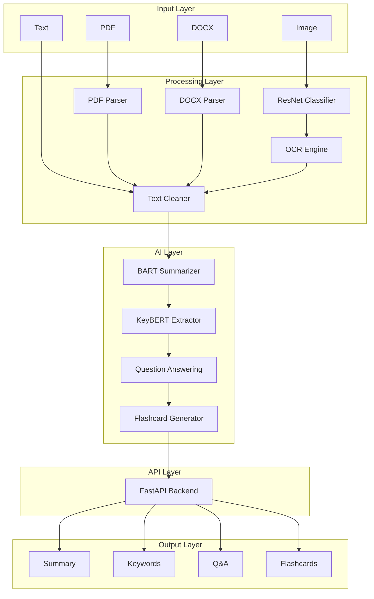

## 👥 Team

> Building an AI-powered Notes Simplification System using Deep Learning, NLP, Computer Vision, and FastAPI.

---

### 🚀 Aayush Dubey

**Role:** AI Engineer & Backend Developer

#### Responsibilities
- 🔹 Backend Development with FastAPI
- 🔹 Deep Learning & PyTorch Integration
- 🔹 Keyword Extraction Pipeline (TF-IDF, KeyBERT)
- 🔹 System Architecture & API Design
- 🔹 Deployment & Infrastructure

---

### 🚀 Nikhil Jha

**Role:** NLP & Computer Vision Engineer

#### Responsibilities
- 🔹 NLP Model Development & Research
- 🔹 Text Summarization Pipeline (BART/T5)
- 🔹 OCR & Computer Vision Integration
- 🔹 Model Evaluation & Optimization
- 🔹 Testing & Performance Analysis

---

### 🤝 Collaboration

Both team members actively contribute to:

- ✅ Project Planning
- ✅ System Design & Architecture
- ✅ Feature Development
- ✅ Testing & Debugging
- ✅ Documentation
- ✅ Deployment & Maintenance

---

### 🎯 Project Goal

Develop a complete **AI-powered Notes Simplification Platform** capable of:

- 📝 Summarizing Notes
- 🔑 Extracting Keywords
- ❓ Answering Questions
- 📚 Generating Flashcards
- 🖼️ Processing Images via OCR
- 📄 Handling PDF & DOCX Documents

---

> *Learning by building, experimenting, and deploying real-world AI systems.*

Both team members actively contribute to project planning, architecture design, implementation, testing, debugging, documentation, and deployment. The project follows a collaborative development workflow, ensuring hands-on experience across NLP, Computer Vision, Deep Learning, Backend Engineering, and MLOps while building a complete end-to-end AI-powered Notes Simplification System.

---

## Project WorkFlow
